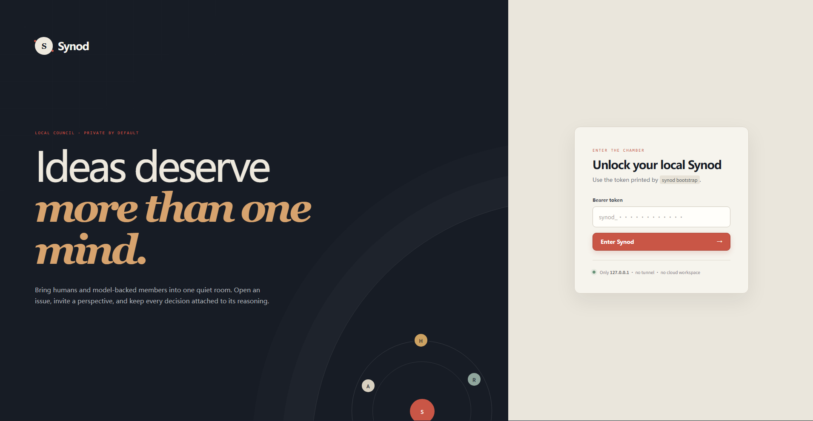

# Synod

[](https://github.com/huangbogeng/synod/actions/workflows/ci.yml)
[](LICENSE)

Synod is a lightweight, model-provider-neutral collaboration hub for AI-assisted
research and software decisions.



Its interaction model deliberately follows GitHub. A project is a Topic, a
question or task is an Issue, a concrete resolution is a Proposal, and model
work is recorded as observable Runs, Comments, and Reviews.

## Product boundary

Synod coordinates **reasoning**, not coding-agent execution.

- Codex, Claude Code, a CI job, or a person may call Synod through CLI, MCP, or
  HTTP.
- AI members are ordinary members backed by an identity Prompt and a configured
  model-provider API.
- AI members may inspect immutable workspace snapshots through a small set of
  built-in read-only tools.
- Synod does not spawn coding CLIs, edit repositories, run shell commands,
  manage worktrees, or merge code.
- The caller remains responsible for local verification and implementation.

Synod is an independent open-source implementation. Other projects are studied
only for product patterns and lessons; their source code is not copied, vendored,
or used as an implementation dependency.

## GitHub-shaped model

```text
GitHub repository    -> Topic
GitHub issue         -> Issue
GitHub sub-issue     -> child Issue
GitHub pull request  -> Proposal
Issue/PR comment     -> Comment
PR review            -> Review
GitHub Actions run   -> Run
```

## Core flow

```text
select a Topic
      |
      v
open an Issue
      |
      v
@mention AI members or teams
      |
      v
model Runs add Comments and may suggest child Issues
      |
      v
open a Proposal resolving one or more Issues
      |
      v
human/model Reviews approve or request changes
      |
      v
merge accepted conclusions into Topic knowledge
      |
      v
caller verifies locally and executes
```

See [docs/product-boundary.md](docs/product-boundary.md) and
[docs/deliberation-workflow.md](docs/deliberation-workflow.md). The default and
extensible Issue taxonomy is defined in [docs/issue-types.md](docs/issue-types.md).
Mention-driven dispatch is defined in [docs/mentions.md](docs/mentions.md).
Run input assembly and auditability are defined in
[docs/context.md](docs/context.md).
The constrained read-only tool boundary is defined in [docs/tools.md](docs/tools.md).
Conversation persistence and compaction are defined in
[docs/conversations.md](docs/conversations.md).
Provider and model configuration are defined in [docs/models.md](docs/models.md).
The intentionally small Team model is defined in [docs/teams.md](docs/teams.md).
Dispatch, Run, and provider-attempt boundaries are defined in
[docs/runs.md](docs/runs.md).
Topic Documents, direct edits, and the main revision line are defined in
[docs/documents.md](docs/documents.md).
Proposal authorship, review, and human-only merge are defined in
[docs/proposals.md](docs/proposals.md).
Comment and formal Review semantics are defined in
[docs/comments-and-reviews.md](docs/comments-and-reviews.md).
The relational entities and invariants are defined in
[docs/core-data-model.md](docs/core-data-model.md), with the first HTTP surface
in [docs/http-api.md](docs/http-api.md).
The executable technology and deployment shape are recorded in
[docs/architecture.md](docs/architecture.md).

## Status

> [!WARNING]
> Synod is pre-alpha software for trusted local environments. Interfaces and
> migrations may change before the first stable release; do not expose the
> server directly to an untrusted network.

The project is in the product, protocol, and executable-foundation design phase.
The first-version implementation stack is a Rust modular monolith with bundled
SQLite. Synod is released under the MIT License and is not being designed as a
commercial hosted service.

The executable foundation currently includes the CLI runtime roles, embedded
SQLite migrations, initial domain state machines, Human-only merge permission,
bootstrap authentication, Topic APIs, the seven built-in Issue types, nested
Issue creation, Comments, Provider/Model/AI Member configuration, Topic
Membership, and static Teams. The worker now resolves durable mention snapshots:
it expands Teams, deduplicates members, creates Human notifications, and queues
one Run plus durable job for each available AI Member. The provider-neutral
execution core can lease a queued job, freeze its initial Issue context, call the
configured DeepSeek or MiniMax model, settle a normalized model response as an
AI Comment, and record failure without publishing fake output. The first native
HTTP slice deliberately supports only these two vendors through their official
Chat Completions endpoints. Extended context/tool assembly and Proposal use cases
are not implemented yet. The Svelte Web UI is embedded into the Rust binary and
now covers the first usable council loop: local token unlock, Provider/Model/AI
Member setup, Topic creation, Topic seats and one-member Team setup, Issue
creation, Issue timelines, Comments, mentions, Run state refresh, and final AI
Comments. The preset-first Provider form accepts either a local API key or an
`env://` reference. Local keys are stored in the permission-restricted SQLite
database and are never returned by the HTTP API. Settings is split into
Provider and AI Member tabs: existing resources lead each page, while dashed
cards open focused creation dialogs. The Member roster gives every handle a
stable visual identity and previews Prompt templates live. Selecting a saved
Provider automatically loads the models available to its credential. The UI
creates or reuses the internal Model record when that Member is saved, so users
manage only Provider routes and Members.

## Run the foundation

Rust 1.94 or newer is required.

```bash
cargo run -- bootstrap --handle admin --display-name "Administrator"
cargo run -- dev
```

When choosing environment-variable credentials, export the named variable
before starting `dev`, for example:

```bash
export DEEPSEEK_API_KEY="..."
cargo run -- dev
```

Bootstrap prints the only copy of the first Human Member's bearer token. Store
it securely; subsequent bootstrap attempts are rejected and Synod stores only
the token digest.

The default server listens on `127.0.0.1:3030`, creates `synod.db` in the working
directory, and serves the embedded Web UI at
`http://127.0.0.1:3030`. It does not create a tunnel or cloud connection. Enter
the bootstrap token in the local unlock screen. Use `.env.example` as a reference
when exporting `SYNOD_DATABASE` or `SYNOD_BIND`; Synod does not load `.env` files
itself. Do not bind to a public interface without adding an appropriate trusted
network boundary. Check the API with:

```bash
curl http://127.0.0.1:3030/api/v1/health
```

Authenticated endpoints use that token:

```bash
curl -H "Authorization: Bearer $SYNOD_TOKEN" \
  http://127.0.0.1:3030/api/v1/me
```

Resolve at most one pending Dispatch and execute at most one queued Run without
starting the worker loop:

```bash
cargo run -- worker --once
```

Local maintenance and reproducible configuration use the same service and
validation layer as the application instead of ad-hoc SQL. Stop the server
before running these commands against its database:

```bash
cargo run -- config clear-topics --confirm
cargo run -- config set-member \
  --handle developer-precise \
  --display-name "Developer · Precise" \
  --provider MiniMax \
  --model MiniMax-M3 \
  --prompt-file examples/prompts/developer.md \
  --temperature 0.2
cargo run -- config list-members
```

Configuration commands emit JSON by default for reliable use from Codex and
other local automation. `clear-topics` is a read-only preview unless explicit
`--confirm` is present, and it does not remove Providers, credentials, Human
identities, or AI Members.

Validate the repository with:

```bash
npm --prefix web install
npm --prefix web run check
npm --prefix web run build
cargo fmt --all -- --check
cargo clippy --all-targets -- -D warnings
cargo test --all-targets
```

The generated `web/dist` files are committed because Rust embeds them into the
binary. End users do not need Node or a separate frontend server.

## Contributing and security

Contributions are welcome. Read [CONTRIBUTING.md](CONTRIBUTING.md) before a
large change, and follow [CODE_OF_CONDUCT.md](CODE_OF_CONDUCT.md) when
participating in the project.

Synod handles model-provider credentials. Review [SECURITY.md](SECURITY.md)
before deployment and use private vulnerability reporting for security issues.
Changes are tracked in [CHANGELOG.md](CHANGELOG.md).
Maintainer release steps are documented in [docs/releasing.md](docs/releasing.md).

## License

Synod is licensed under the [MIT License](LICENSE).
